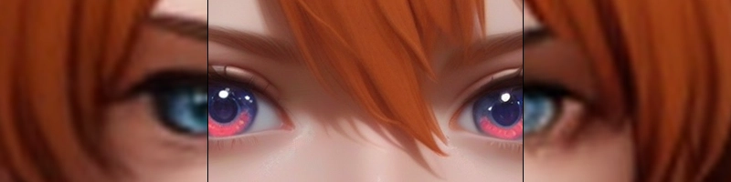

<div align="center">
  
  <h1 align="center">ComfyUI Forbidden Vision</h1>
  <p align="center">
    A powerful and flexible node for face restoration in ComfyUI. It enhances faces using conditioned inpainting, integrates with existing detection workflows, and includes a bonus Latent AI Upscaler.
  </p>
  <p align="center">
    <a href="https://github.com/luxdelux7/ComfyUI-Forbidden-Vision/blob/main/LICENSE"></a>
    <a href="https://github.com/luxdelux7/ComfyUI-Forbidden-Vision/stargazers"></a>
    <a href="https://github.com/luxdelux7/ComfyUI-Forbidden-Vision/issues"></a>
  </p>
</div>

---

## ✨ Overview

This repository provides two main nodes:

1.  **Face Processor Node**: An all-in-one face enhancement tool. It takes face segmentation data (`SEGS`) from another node (like the Impact Pack detector) or a manual mask and performs a high-quality, guided restoration.
2.  **Latent AI Upscaler Node**: A utility node for performing a hybrid ESRGAN + standard resize upscale workflow, operating between latent and pixel space.

The main goal is to provide a robust, easy-to-use enhancement solution that gives the user fine-grained control over the restoration process.

---

## 🚀 Key Features of the Face Processor

This node is designed to be a powerful drop-in replacement for other face detailing nodes. Its strength lies in the quality and control it offers over the enhancement process.

*   **Conditioned Inpainting at Native Resolution**: For best quality and performance the face area is cropped and processed at a specified resolution (e.g., 1024x1024), allowing the model to generate details at its optimal quality. We use integrated Inpaint Conditioning which helps grounding the face with it's surrounding context. Especially useful for NSFW situations!
*   **Built-in Optimal Blur**: Gaussian blur is automatically applied to the mask with easy settings that ensure optimal results.
*   **Differential Diffusion Compatibility**: The node works seamlessly with ComfyUI's **Differential Diffusion** node. While not required, using it can significantly improve detail preservation and coherence, especially when using higher denoise values.
*   **Flexible Prompting Control**: To further guide the conditioned inpainting, you can supply face-specific prompts. Choose to **prepend** them to your main prompt for subtle guidance or **replace** the main prompt entirely for maximum control over expressions, style, or features. This way you can completely replace the face!
*   **AI Pre-Upscaling for Low-Resolution Faces**: If a detected face is too small, the node can optionally use an ESRGAN model to upscale it *before* the inpainting pass. This provides the diffusion model with a better source image, leading to a more detailed result.
*   **Automatic Mask and Color Correction**: The node includes automated cleanup logic to refine input masks (filling holes, removing noise). After processing, it performs LAB color correction to match the new face to the original scene's lighting, ensuring a seamless blend. 
*   **Streamlined Multi-Face Workflow**: When connected to a `SEGS` input, the node automatically processes all Impact Pack detected faces. A `face_selection` parameter allows you to easily target a specific face (e.g., the largest) instead.
*   **Simple Vertical Switch**: Have weird poses with upside down character faces? Flip the switch and the node will automatically ivert, process and paste back in as intended.
*   **Simple Integration**: Designed to be easy to use. Connect your image, model, VAE, conditioning, and face data (`SEGS` or `MASK`), and the node handles the complex chain of cropping, upscaling, inpainting, and blending.

### 🔮 Latent AI Upscaler Node

This node is designed primarily as a bridge between two samplers in a 2-pass workflow. Using an upscale 2x or 4x model with just a 1.2 resize will generally make the 2nd pass sampler give you much better results than regular latent upscaling.

*   **Hybrid Upscale Pipeline**: Decodes a latent, upscales it with an ESRGAN model, resizes it to a final target scale, and then re-encodes it back to a latent.
*   **Smart Sharpening**: An optional post-resize sharpening pass to enhance details.
*   **Tiled VAE Support**: Handles large images on VRAM-limited hardware by encoding in tiles.

---
## 🖼️ Example

<div align="center">
  
  
  <p><em>Enhanced facial detail and image resolution using Forbidden Vision.</em></p>
</div>
---

## ⚙️ Installation

### Via ComfyUI Manager

1.  Open ComfyUI Manager.
2.  Click `Install Custom Nodes`.
3.  Search for `Forbidden Vision` and click **Install**.
4.  Restart ComfyUI.

### Manual Install

```bash
cd ComfyUI/custom_nodes
git clone https://github.com/luxdelux7/ComfyUI-Forbidden-Vision.git
```


Then restart ComfyUI.

### Required Models & Nodes

This node is designed to integrate with other tools. You will need:

| Type | Recommended Node/Model | Notes |
| :--- | :--- | :--- |
| **Face Detection** | **ComfyUI-Impact-Pack** | Use a detector from this pack (e.g., `SEGS Detailer (pipe)`) to generate the **`SEGS`** input. Our node replaces the need for the `FaceDetailer` node itself, but not the initial detection. |
| **ESRGAN Upscaler** | `4x_NMKD-Siax_200k.pth` or `4x-UltraSharp.pth` | Required for the *Pre-upscale* feature in the Face Processor and for the *Latent AI Upscaler*. Place models in **`ComfyUI/models/upscale_models`**. |

---

## 📚 Node Reference

### Forbidden Vision - Face Processor

**Inputs**
*   `image`, `model`, `vae`, `positive`, `negative`: Standard ComfyUI pipeline inputs.
*   `segs` (Optional): Face detection data from an upstream node (e.g., Impact Pack). Use this **or** `mask`.
*   `mask` (Optional): A manual mask for the face area. Use this **or** `segs`.
*   `clip` (Optional): **Required only if** you are using `face_positive_prompt` or `face_negative_prompt`.
*   `processing_resolution`: The resolution for the cropped face inpainting (e.g., 1024 for a 1024x1024 process).
*   `enable_pre_upscale`: Enables the AI upscaler for small faces before the main processing step.
*   `face_positive_prompt`, `face_negative_prompt`: Additional prompts to guide the face inpainting.
*   `replace_positive_prompt`, `replace_negative_prompt`: If true, the face prompts will overwrite the main prompts instead of being prepended.
*   `blend_softness`: Controls the feathering of the blending mask to ensure a smooth transition.
*   `face_selection`: `0` to process all detected faces, `1` for the largest, `2` for the second largest, etc.

### Forbidden Vision - Latent AI Upscaler

**Inputs**
*   `upscale_model`: The ESRGAN model for the pixel-space upscale pass.
*   `upscale_factor`: The final size multiplier for the image (e.g., `1.5` for a 50% increase).
*   `enable_smart_sharpen`: Applies a detail-aware sharpening filter after upscaling.
*   `use_tiled_vae`: Enables tiled VAE encoding to save VRAM on large images.

---

## 🧪 Troubleshooting

*   **No Face Processed?**
    *   Ensure either a `segs` or `mask` input is connected.
    *   If using `segs`, verify that your upstream detection node (from Impact Pack, etc.) is correctly identifying faces and is connected to the input. Check the confidence threshold on your detector.
*   **Visible Seams or Bad Blend?**
    *   Increase the `blend_softness` and/or `mask_expansion` values.
    *   Make sure `enable_color_correction` is turned on (it is by default).
*   **Blurry or Low-Detail Results?**
    *   Increase the `processing_resolution` to a higher value (e.g., 1024).
    *   If the original face is very small, ensure `enable_pre_upscale` is active with a good `upscaler_model` selected.
*   **Artifacts or Unwanted Features on the Face?**
    *   Use the `face_negative_prompt` to describe what you want to avoid (e.g., "blurry, artifacts, ugly, distorted").
    *   Adjust the `denoise_strength`. High values give the model more freedom but can also introduce unwanted changes.

---

## ⚖️ License

This project is licensed under the **GNU General Public License v3.0**. See the [LICENSE](LICENSE) file for details.