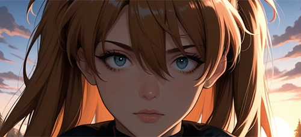
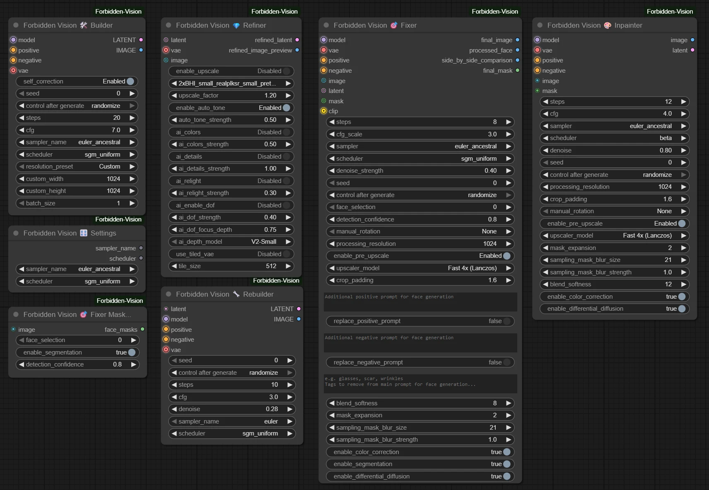
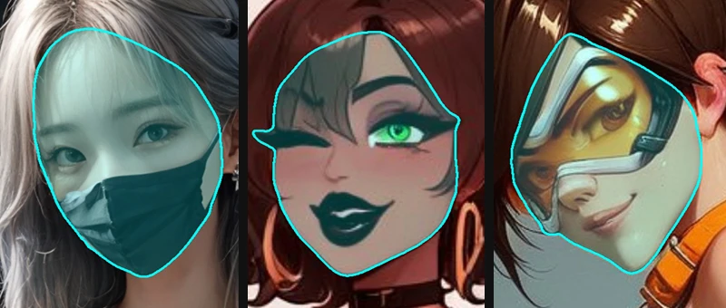
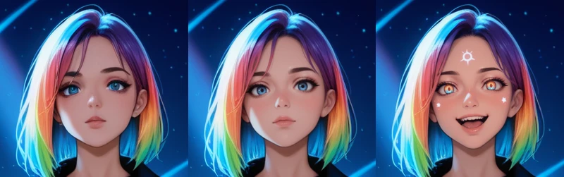
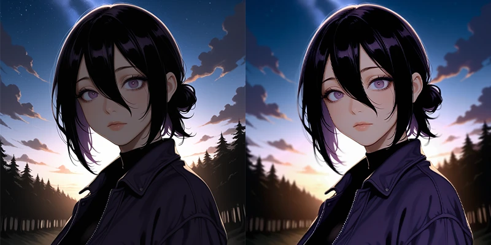
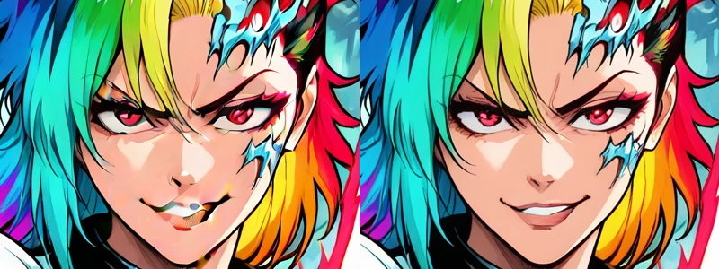

<div align="center">
  
  <h1>ComfyUI Forbidden Vision</h1>
  <p>
    Face restoration, enhancement, and sampling nodes built for the content you actually generate.
  </p>
  <a href="https://ko-fi.com/luxdelux" target="_blank">
    
  </a>
</div>

<br>

## 🎯 The Difference

Most restoration models are trained on narrow datasets—usually just real faces or just anime—resulting in poor detection on stylized AI content.

Forbidden Vision uses **custom detection engines trained on a manually curated dataset** sourced from CivitAI, Danbooru, and real photography (SFW & NSFW). This hybrid training allows the **Fixer** to handle high-denoise generation, drastically altering or replacing faces while maintaining seamless lighting and style consistency with the original image.

<br>

<table>
  <tr>
    <td width="45%" valign="top">
      <h3>From Weak Base to Finished Render</h3>
      <p>Forbidden Vision turns weak inputs into quality final generations.</p>
      <p><strong>The pipeline in action:</strong></p>
      <p>
        <b>1. Base:</b> A weak, underlit generation.<br>
        <b>2. Refiner:</b> Corrects exposure, tone, colors, and adds depth of field.<br>
        <b>3. Fixer:</b> Drastically reshapes the face (0.8 denoise) seamlessly.
      </p>
    </td>
    <td width="55%" valign="top">
      
    </td>
  </tr>
</table>

<br>

<br>

## ✨ What's Included

<table>
  <tr>
    <td width="55%" valign="top">
      <a href="./images/nodes.webp" target="_blank">
        
      </a>
    </td>
    <td width="45%" valign="top">
      <p><strong>The Core Suite</strong></p>
      <ul>
        <li><strong>Fixer</strong> – Face detection, restoration, and context-aware inpainting.</li>
        <li><strong>Refiner</strong> – Automatic enhancement with tone correction, upscaling, and effects.</li>
        <li><strong>Builder</strong> – First-pass sampling with adaptive CFG and self-correction.</li>
      </ul>
      <p><strong>Versatile Tools</strong></p>
      <ul>
        <li><strong>Inpainter</strong> – The Fixer’s blending engine in a manual inpainting node.</li>
        <li><strong>Rebuilder</strong> – Basic ksampler with integrated VAE decoding.</li>
        <li><strong>Fixer Mask</strong> – Outputs masks from the detection models.</li>
        <li><strong>Settings</strong> – Simple output for samplers/schedulers.</li>
      </ul>
    </td>
  </tr>
</table>

## 🎭 Fixer Node

The Fixer node replaces complex face restoration workflows with a single, reliable node solution. Using 2 custom trained models for detection and mask segmentation you get consistent results with fast performance. Works with both realistic and anime styles for any level of face modification.
> The models are downloaded automatically from their [Hugging Face page](https://huggingface.co/luxdelux7/ForbiddenVision_Models) on first ComfyUI run

<div align="center">

<p><em>Forbidden Vision segmentation model takes into account face masks, stylistic eyebrows, eyelashes etc. so the inpainting isn't limited</em></p>
</div>

**Key Features:**


* **Face Detection and Masking**: With custom trained Yolo 11 Small detection and EfficientNet-v2 auto masking models
* **NSFW friendly**: Works reliably on all adult content without filtering or judgement.
* **Detail aware segmentation**: Detects eyebrows, eyelashes, sunglasses etc. within the face to ensure best inpainting results
* **Context-Aware Inpainting**: Crops detected faces, processes them at optimal resolution, and uses conditioned inpainting together with built in differential diffusion to match the original image's lighting and style.
* **Flexible Prompt Control**: Add details to existing prompts, replace prompts entirely, or exclude specific tags just for face processing.
* **AI Pre-Upscaling**: Upscale small faces with AI models before processing for better detail in the final result.
* **Smart Blending**: Applies automatic color correction and feathered mask blending for seamless integration with the original image

<div align="center">

<p><em>Original (left), then with 0.3 denoise (middle) and with appended prompt at 0.7 denoise (right)</em></p>
</div>

### 🔮 Refiner Node

The Refiner node handles automatic image enhancement that would normally require manual work in external editors. It provides intelligent tone mapping, color correction, and lighting adjustments — plus optional AI upscaling and depth of field simulation.

> **Tip:** The Refiner shines as a pre-pass before your second sampling stage, producing smoother, more unified results.  
> It also works perfectly well as a standalone image enhancer.

<div align="center">

<p><em>A first-pass image enhanced with the Refiner's Auto Tone (0.5), Colors (0.5), Depth of Field (0.4 strength, 0.75 depth) and Relight (0.8)</em></p>
</div>


#### Key Features:

* **Auto Tone & Color Correction**: Analyzes and adjusts lighting, contrast, and color balance automatically. 
* **Highlight Clipping Correction**: Ensures highlights or shadows don't go overboard
* **AI Upscaling & Detail Enhancement**: Includes model-based upscaling and intelligent sharpening
* **Depth of Field Effects**: Simulates depth of field using depth maps
* **Dual Input/Output Support**: Works with both latents and images, fitting anywhere in your workflow.

### 🏗️ Builder Node

A first-pass sampler with built-in self-correction for improved initial generations.

<div align="center">

<p><em>5 active Loras at CFG 7 before (left) and after self-correction (right)</em></p>
</div>

**Key Features:**

* **Self-Correction**: A final 2 step polish pass that automatically refines the generated image with minimal denoising of 0.05 for cleaner results.
* **Resolution Presets**: Built-in SDXL, SD1.5 and other optimal resolution presets, plus custom sizing.
* **Integrated VAE Decoding**: Automatically outputs both latent and decoded image when VAE is connected.

---


### Instructions

<details>
<summary><strong>⚙️ [ Installation ]</strong></summary>

### Via ComfyUI Manager

1.  Open ComfyUI Manager.
2.  Click `Install Custom Nodes`.
3.  Search for `Forbidden Vision` and click **Install**.
4.  Restart ComfyUI.

### Manual Install

```bash
cd ComfyUI/custom_nodes
git clone https://github.com/luxdelux7/ComfyUI-Forbidden-Vision.git

Then navigate to folder

cd ComfyUI-Forbidden-Vision
..\..\..\python_embeded\python.exe -m pip install -r requirements.txt

For standard Python installations:
pip install -r requirements.txt
```


Then restart ComfyUI.
</details>

---

<details>
<summary><strong>📦 [ Models ]</strong></summary>


## Upscaler Models

Use any upscale model you prefer, however for both speed and quality I found [Phhofm models](https://github.com/Phhofm/models) to be great, specifically:

**For Fixer:**
- [4xBHI_realplksr_dysample_real](https://github.com/Phhofm/models/releases/download/4xbhi_realplksr/4xBHI_realplksr_dysample_real.pth)

**For Builder:**
- [2xBHI_small_realplksr_small_pretrain](https://github.com/Phhofm/models/releases/download/2xBHI_small_realplksr_small_pretrain/2xBHI_small_realplksr_small_pretrain.pth)

Generally, for faces you want a 4x model, and for the refiner (if using before second pass sampling) you want around 2x for speed, but feel free to use what you prefer.

</details>

---

<details>
<summary><strong>🎭 [ Fixer Settings ]</strong></summary>

### Core Sampling

- The sampling options are the same as the core ksampler. I set **euler_ancestral** with **sgm_uniform** as default as that is usually what I use with most SDXL based models.
- For general fixing **denoise_strength** of between 0.2 - 0.4 at even **8 steps** will usually give decent results but I prefer to go higer
- With low denoise **CFG** doesn't impact the generation that much, but keep it moderate to be on the safe side -> default of 3 is good.
- If you want bigger changes, the node will do well even up to **0.9** denoise (depending on image) however for such cases you'll probably want to modify the prompts and maybe use a different scheduler like beta

### Face Selection & Processing

**face_selection**  
0 = process all detected faces. Set 1 or higher to target a specific detected face in order (e.g., the closest face or the one you want edited).

**detection_confidence**  
YOLO’s confidence threshold for face detection. 0.75 works for about 90% of images. Strong detections typically fall between 0.86–0.90+. Lower only if your image has extreme stylization or very small faces.

**manual_rotation**  
Useful for images where faces appear at unusual angles (including upside-down). The node rotates the face for optimal processing and automatically rotates it back during blending.

**processing_resolution**  
The 1:1 square resolution used for cropping the detected face during sampling (default: 1024). Adjust based on the resolution sweet-spot of your model. Higher = more detail, but also more VRAM and time.

**enable_pre_upscale**  
Pre-upscales the cropped face region before feeding it into sampling. This improves detail restoration on low-resolution faces. Enabled by default and recommended for most workflows.

**upscaler_model**  
Choose between Bicubic/Lanczos (fast Python scaling) or an AI upscaler (recommended: 4×). AI models give sharper and more stable facial details.

**crop_padding**  
Determines how much surrounding context is included around the face (default: 1.6). More padding = better inpainting consistency, since the model sees more of the original image’s lighting and style.

---

### Prompting  
**CLIP input must be connected for these options to work.**

**face_positive_prompt / face_negative_prompt**  
Tags added here are prepended to the connected conditioning. Great for adding or guiding face details without altering the global prompt.

**replace toggles**  
Instead of adding tags, these toggles completely replace the connected conditioning for the face sample. Useful when you want full control over the facial generation prompt.

**exclusions**  
Removes specific tags from the positive conditioning. Ideal for removing unwanted traits (e.g., “smile”, “angry”, “glasses”) while keeping the rest of your prompt intact.

---

### Blending & Masking

**blend_softness**  
Applies subtle feathering to the blended region, improving the transition between the generated face and the original background.

**mask_expansion**  
Uniformly expands the segmentation mask by a set number of pixels (default: 2). Helps avoid harsh transitions by including slightly more skin and edge detail.

**sampling_mask_blur_size**  
The radius of the blur applied to mask edges (default: 21). Larger values create a wider falloff area around the mask border.

**sampling_mask_blur_strength**  
Determines how strongly the blur is applied (default: 1.0). Higher values further soften the mask edge for more natural blending.

---

### Major Toggles

**enable_color_correction**  
Analyzes the entire image’s tone and lighting, then adjusts the newly sampled face to match it. Prevents mismatched brightness or color shifts.

**enable_segmentation**  
Uses the segmentation model to generate a detailed mask (including eyebrows, eyelashes, facial hair, sunglasses, etc.). When off, falls back to a simple oval mask based on YOLO’s bounding box.

**enable_differential_diffusion**  
Uses integrated differential diffusion for smoother, more coherent inpainting. Recommended in almost all cases for the most natural results.


</details>

---

<details>
<summary><strong>🔮 [ Refiner Settings ]</strong></summary>

### Upscaling

**enable_upscale**  
Enables optional AI or bicubic upscaling after tone/color/detail processing. Useful before a second sampling pass or as a final enhancement step.

**upscale_model**  
Select which upscaler to load. Models are auto-detected from your installation. AI upscalers generally produce crisper, more stable images.

**upscale_factor**  
Scales the image before optional re-encoding. I personally prefer 1.2 before a second diffusion pass.

---

### Auto Tone

**enable_auto_tone**  
Runs an advanced tone analysis (exposure, black depth, shadow balance, contrast, highlight clipping). This produces a Camera-RAW-style correction pass that adapts intelligently to the image’s histogram.

**auto_tone_strength**  
Blends between original and fully auto-toned output.  
- Low values = gentle correction  
- High values = deeper blacks, cleaner highlights, more stable global contrast  

---

### AI Color Controls

**ai_colors**  
Enables the vibrance/saturation enhancement module. Unlike simple saturation, vibrance selectively boosts mid-to-low chroma regions while protecting skin tones and sensitive ranges.

**ai_colors_strength**  
Controls vibrance intensity. Internally adapts strength based on luminance and chroma statistics to avoid clipping.

---

### AI Details

**ai_details**  
Enables a depth-aware detail enhancement pipeline. Operates similarly to “clarity”:  
- Enhances small-scale textures  
- Suppresses halos  
- Avoids reintroducing noise  
- Reduces sharpening in blurred/background regions (via depth map)

**ai_details_strength**  
Controls the intensity of texture enhancement. Values above ~1.5 strongly boost micro-textures; lower values are more natural.

---

### AI Relighting

**ai_relight**  
Adjusts scene lighting using depth + luminance curves. Brightens subject regions while respecting color stability and avoiding highlight clipping.

**ai_relight_strength**  
Intensity of relighting effect. Designed to subtly lift faces, characters, and foreground regions without flattening shadows or blowing highlights.

---

### AI Depth of Field

**ai_enable_dof**  
Simulates depth of field using an estimated depth map. Foreground and background are blurred based on distance from a computed focus plane.

**ai_dof_strength**  
Controls the blur intensity. Higher values widen bokeh and separation.

**ai_dof_focus_depth**  
Determines where the virtual focus plane sits (0.50–0.99). Lower = closer focus, higher = deeper focus.

**ai_depth_model**  
Choose the depth model used for depth inference.  
- **V2-Small** — faster, less VRAM  
- **V2-Base** — more accurate and stable depth

---

### Tiled VAE Encoding

**use_tiled_vae**  
When re-encoding the final image into a latent, uses tiled VAE encoding to prevent seams and reduce VRAM load. Useful for high-resolution refinement.

**tile_size**  
Size of each tile during VAE encoding. Larger tiles = faster but more VRAM; smaller tiles = safer for low VRAM systems.

---

### Input / Output Behavior

**latent** *(optional)*  
Latent input for refinement. If provided, Refiner decodes it (with caching) and processes the result.

**image** *(optional)*  
Direct image input. Skips decoding if latent isn’t provided.

**vae** *(optional)*  
Used to re-encode the processed image back into latent form. Required when you want to feed the refined output into another diffusion step.
</details>

---

<details>
<summary><strong>🏗️ [ Builder Settings ]</strong></summary>


### Core Sampling

**self_correction**  
Performs a low-denoise, 2-step polishing pass at the end of sampling. This corrects small inconsistencies, stabilizes shapes, and reduces overcooked artifacts. Recommended ON for most workflows.

**seed**  
The base seed for initial noise generation. If self-correction is enabled, the polish pass automatically uses `seed + 1`.

**steps**  
Number of sampling steps. Higher values generally improve quality but increase time. The final polish pass always uses 2 steps regardless of this setting.

**cfg**  
Classifier-free guidance. Higher values push the image toward the prompt but may introduce artifacts. Defaults to 7 for a strong but stable prompt adherence.

**sampler_name**  
The sampling algorithm. Defaults to **euler_ancestral**, which pairs well with SDXL and produces stable early-pass structure for character renders.

**scheduler**  
Controls how noise is scheduled across steps. Default is **sgm_uniform**, a reliable all-rounder for SDXL.

---

### Resolution & Batch

**resolution_preset**  
Choose from a set of pre-defined “ideal” SDXL/SD1.5 aspect-ratio presets. When set to **Custom**, width/height use the fields below.

**custom_width**  
Manual width when using “Custom” mode. Must be divisible by 64, since SD latent resolution = image/8.

**custom_height**  
Same as above but for height.

**batch_size**  
Generates multiple independent images from the same prompt at once. Be mindful of VRAM usage — high resolutions + large batch sizes may exceed GPU memory.

---

### Conditioning Inputs

**positive / negative**  
The conditioning tensors generated by your CLIP-like encoder. Required for the Builder to generate a meaningful latent.

**model**  
Your diffusion model (SDXL, SD1.5, SD2.1). Determines architecture, sampling behavior, and resolution constraints.

**vae** *(optional)*  
If connected, the Builder decodes the final latent to an image preview. If not, output preview is a blank placeholder but the latent remains valid.

</details>


---


## ⚖️ License

This project is licensed under the **GNU General Public License v3.0**. See the [LICENSE](LICENSE) file for details.